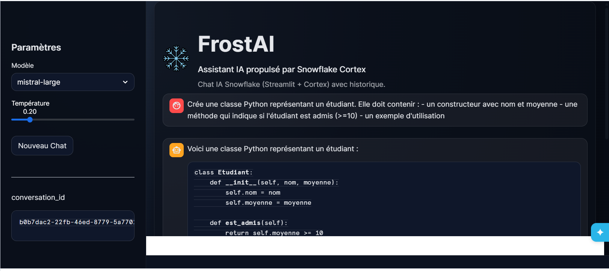
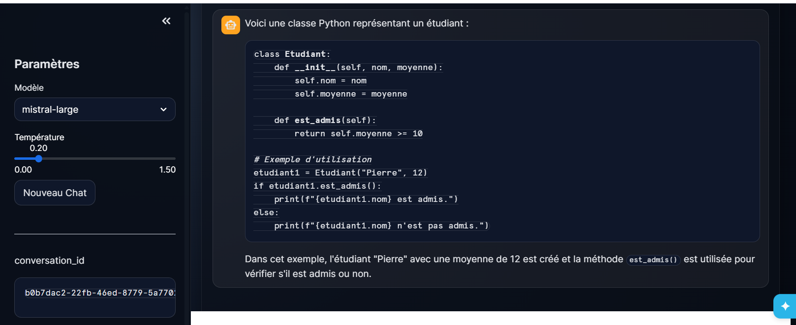

# ❄️ FrostAI  
Application conversationnelle basée sur Snowflake Cortex

---

## 📌 Description du projet

FrostAI est une application web conversationnelle développée avec **Streamlit in Snowflake** et connectée à **Snowflake Cortex**.

Elle permet à un utilisateur de dialoguer avec un modèle LLM directement depuis l’environnement Snowflake, sans utiliser d’API externe ni de clé OpenAI.

Le projet démontre l’intégration complète d’un modèle de langage dans une architecture 100 % Snowflake, incluant :

- Interface utilisateur
- Génération de réponse via LLM
- Persistance des conversations
- Déploiement dans Snowflake

---

## Captures

### Application

## 🏗️ Architecture technique

L’application repose sur les composants suivants :

- **Streamlit in Snowflake** → Interface utilisateur  
- **Snowflake Cortex** → Inférence LLM  
- **Snowpark Python** → Exécution des requêtes SQL  
- **Table Snowflake** → Stockage des conversations  

### 🔄 Flux de fonctionnement

Utilisateur  
→ Interface Streamlit  
→ Appel Snowflake Cortex  
→ Réponse générée  
→ Stockage dans Snowflake  

Aucune donnée ne quitte l’environnement Snowflake.

---

## 🧱 Environnement Snowflake

L’application utilise :

- Un Warehouse  
- Une Database  
- Un Schema  
- Une table de persistance  
- L’activation du paramètre `CORTEX_ENABLED_CROSS_REGION`  

### Prérequis :

- Accès à un Warehouse  
- Droits de création Database / Schema  
- Accès à Streamlit in Snowflake  
- Accès aux fonctionnalités Snowflake Cortex  

---

## 💬 Fonctionnalités de l’interface

### Interface principale

- En-tête personnalisé (logo + nom + description)
- Zone d’affichage des messages
- Zone de saisie utilisateur
- Affichage dynamique des réponses LLM

### Sidebar

- Sélecteur de modèle Cortex
- Slider de température (0.0 – 1.5)
- Bouton “Nouveau Chat”
- Affichage du `conversation_id`

---

## 🧠 Intégration Snowflake Cortex

L’application :

- Construit un prompt basé sur :
  - Une instruction système
  - L’historique de conversation
  - Le dernier message utilisateur

- Transmet au modèle :
  - Le modèle sélectionné
  - La température
  - Le prompt complet

- Affiche la réponse générée dans l’interface

⚠️ Aucun usage de clé OpenAI.  
L’appel au modèle est effectué exclusivement via Snowflake Cortex.

---

## 💾 Persistance des conversations

Chaque message est enregistré avec :

- `conversation_id`
- `timestamp`
- `role` (user / assistant)
- `content`

Cela permet :

- Audit des échanges
- Analyse des conversations
- Possibilité de rechargement futur

---

# 🧠 Réponses aux questions de validation

## 1️⃣ Quel modèle Cortex avez-vous utilisé et pourquoi ?

Le modèle principal utilisé est **mistral-large**.

Motivations :

- Bon compromis qualité / latence
- Performances solides en français
- Stabilité conversationnelle
- Compatibilité complète avec l’API Cortex `COMPLETE`

---

## 2️⃣ Comment gérez-vous la taille de l’historique ?

L’historique est limité à un nombre fixe de messages récents.

Objectifs :

- Contrôler le nombre de tokens
- Réduire la latence
- Maintenir des performances constantes

Seuls les derniers échanges sont utilisés pour générer la réponse.

---

## 3️⃣ Comment avez-vous construit le prompt ?

Le prompt suit cette structure :

Instruction système  
+  
Historique conversationnel  
+  
Dernier message utilisateur  

L’instruction système définit le comportement attendu du modèle.

Cette structure permet :

- Cohérence des réponses
- Contrôle du ton
- Réduction des dérives

---

## 4️⃣ Quelles difficultés techniques avez-vous rencontrées ?

### Gestion des appels Cortex
- Contraintes sur les types SQL
- Obligation d’utiliser un modèle en littéral
- Gestion précise du JSON

### Gestion du state Streamlit
- Erreurs liées à la modification de `session_state` après instanciation des widgets
- Nécessité d’une initialisation stricte en début de script

### Personnalisation CSS
- Les composants BaseWeb utilisent un portal pour les menus
- Surcharge CSS complexe pour supprimer les fonds blancs

---

## 5️⃣ Comment garantir la confidentialité des conversations ?

- Stockage exclusif dans Snowflake
- Modèle RBAC Snowflake
- Chiffrement natif des données
- Aucune API externe
- Aucun transfert hors environnement Snowflake

---

## 📦 Structure du repository

<!-- TEST TREE START -->

<pre>
frostai/
├── app/
│   └── streamlit_app.py
├── sql/
│   ├── 00_setup.sql
│   ├── 01_table.sql
│   ├── 02_admin_cortex.sql
│   └── 99_debug.sql
└── README.md
</pre>

<!-- TEST TREE END -->

### 📁 Détail des fichiers

- **app/streamlit_app.py**  
  Application principale Streamlit (interface + appel Cortex + persistance).

- **sql/00_setup.sql**  
  Création du Warehouse, Database, Schema et configuration initiale.

- **sql/01_table.sql**  
  Création de la table `CHAT_MESSAGES` pour la persistance.

- **sql/02_admin_cortex.sql**  
  Activation et vérification des paramètres Snowflake Cortex.

- **sql/99_debug.sql**  
  Requêtes de test, vérifications et consultation des messages stockés.

- **README.md**  
  Documentation complète du projet.

---

## 🚀 Déploiement

1. Configurer l’environnement Snowflake  
2. Exécuter les scripts SQL  
3. Créer l’application Streamlit in Snowflake  
4. Coller le code Python  
5. Lancer l’application  

Le projet est entièrement reproductible.

---

## 📊 Critères couverts

- Interface ergonomique
- Gestion d’état fonctionnelle
- Intégration Cortex correcte
- Gestion des erreurs
- Persistance opérationnelle
- Documentation complète
- Projet reproductible

---

## 🎯 Conclusion

FrostAI démontre une intégration complète entre :

- Interface Streamlit  
- Snowflake Cortex  
- Persistance Snowflake  

Le projet respecte toutes les contraintes :

- Pas de clé OpenAI  
- Appel via Snowflake uniquement  
- Modèle supporté par Cortex  
- Déploiement interne Snowflake  

